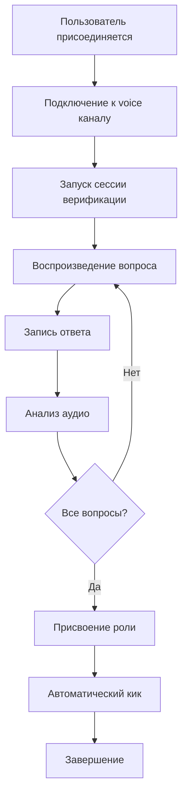

# 🎙️ Discord Voice Verification Bot

<div align="center">


*Автоматизированная система голосовой верификации для Discord серверов с расширенной аналитикой*

[📋 Возможности](#-возможности) • [🚀 Установка](#-установка) • [⚙️ Настройка](#️-настройка) • [📖 Использование](#-использование) • [🛠️ API](#️-api)

</div>

---

## 🌟 Обзор

**Discord Voice Verification Bot** — это профессиональная система верификации пользователей через голосовые сообщения. Бот автоматически проводит интервью с новыми участниками сервера, записывает их ответы и анализирует качество аудио для обеспечения безопасности сообщества.

### ✨ Ключевые особенности

🎯 **Умная верификация** — Автоматические голосовые вопросы с адаптивной оценкой  
📊 **Глубокая аналитика** — Анализ качества звука, RMS, частоты дискретизации  
🛡️ **Безопасность** — Защита от ботов и фейковых аккаунтов  
⚡ **Высокая производительность** — Асинхронная обработка множественных сессий  
🎨 **Красивый интерфейс** — Информативные embed-сообщения с real-time статусом  

---

## 🎯 Возможности

### 🎤 Голосовая верификация
- **Автоматические вопросы** — Настраиваемый список вопросов для верификации
- **Запись ответов** — Высококачественная запись в PCM16 формате
- **Адаптивные таймеры** — Разные временные лимиты для разных типов вопросов
- **Поддержка множественных форматов** — WAV, MP3, OGG через FFmpeg

### 📈 Продвинутая аналитика
```python
# Многоуровневая система анализа
🔬 Librosa Analysis    # Максимальная точность
🎵 Pydub Analysis      # Средняя точность  
📊 FFprobe Analysis    # Базовая информация
💾 Fallback System     # Аварийная оценка
```

### 🛠️ Технические характеристики

| Параметр | Значение | Описание |
|----------|----------|----------|
| **Формат записи** | PCM16 44.1kHz | Студийное качество |
| **Анализ RMS** | Real-time | Оценка громкости |
| **Качество звука** | 0-100% | Адаптивная система оценки |
| **Сессии** | Неограниченно | Concurrent processing |
| **Платформы** | Windows/Linux/macOS | Cross-platform |

---

## 🚀 Установка

### Требования
- **Python 3.8+**
- **FFmpeg** (для аудио обработки)
- **Discord Bot Token**
- **Права администратора** на сервере

### Быстрый старт

```bash
# 1. Клонирование репозитория
git clone https://github.com/yourusername/discord-voice-verification-bot.git
cd discord-voice-verification-bot

# 2. Установка зависимостей
pip install -r requirements.txt

# 3. Настройка окружения
cp .env.example .env

# .env файл должен содержать:
DISCORD_TOKEN=your_bot_token_here

# 4. Запуск бота
python main.py
```

### Зависимости

```txt
discord.py>=2.3.0
librosa>=0.10.0
pydub>=0.25.1
numpy>=1.24.0
asyncio
pathlib
```

---

## ⚙️ Настройка

### 🔧 Основная конфигурация

```python
# config/settings.py
import os
from typing import List, Dict
from dataclasses import dataclass
from dotenv import load_dotenv

# Загружаем переменные окружения из файла .env
load_dotenv()

@dataclass
class BotSettings:
    """
    Конфигурация бота. Здесь указываются все параметры:
    токен, ID каналов, ID ролей, вопросы для верификации, 
    длительности записей и аудио-файлы.
    """
    
    # 🔐 Токен бота (должен быть в .env)
    token: str
    
    # 🛠️ Префикс команд (если вы используете prefix-команды)
    command_prefix: str = "!"
    
    # 🔊 ID голосового канала, в котором происходит верификация
    voice_channel_id: int = 1378734533410689155
    
    # 💬 ID текстового канала для логов/коммуникации
    text_channel_id: int = 1378763397335879832
    
    # 🎭 Роли
    verified_role_id: int = 1376499305698951269       # ID роли для прошедших верификацию
    unverified_role_id: int = 1376499288888053800     # ID роли для новых пользователей
    
    # ❓ Вопросы для голосовой верификации
    questions: List[str] = None
    
    # ⏱️ Длительности аудиозаписи для каждого вопроса
    recording_durations: List[int] = None
    
    # 🔉 Путь к аудиофайлам (вопросы/завершение)
    audio_files: Dict[str, str] = None
    
    def __post_init__(self):
        """
        Метод вызывается автоматически после инициализации.
        Заполняет значения по умолчанию, если они не заданы.
        """
        if self.questions is None:
            self.questions = [
                "Сколько тебе лет?",
                "Скажи, я хочу получить доступ к серверу Arunya"
            ]
        
        if self.recording_durations is None:
            self.recording_durations = [3, 6]  # в секундах
        
        if self.audio_files is None:
            self.audio_files = {
                "Сколько тебе лет?": "assets/audio/question_1.mp3",
                "Скажи, я хочу получить доступ к серверу Arunya": "assets/audio/question_2.mp3",
                "completion": "assets/audio/completion.mp3"
            }

# 📦 Глобальный объект настроек, который можно импортировать по всему проекту
settings = BotSettings(
    token=os.getenv("DISCORD_TOKEN", ""),  # Читает токен из .env
)
```

### 🎵 Настройка аудио системы

```yaml
# Параметры качества
Audio Quality Thresholds:
  🟢 Отлично (80-100%):
    - RMS: > 0.02
    - Размер: > 15KB/сек
    - Длительность: 90-130% от ожидаемой
    
  🟡 Хорошо (60-79%):
    - RMS: 0.01-0.02
    - Размер: 10-15KB/сек
    - Длительность: 70-150% от ожидаемой
    
  🟠 Удовлетворительно (40-59%):
    - RMS: 0.005-0.01
    - Размер: 5-10KB/сек
    - Длительность: 50-200% от ожидаемой
    
  🔴 Плохо (<40%):
    - RMS: < 0.005
    - Размер: < 5KB/сек
    - Тишина или технические проблемы
```

---

## 📖 Использование

### 🔄 Процесс верификации



### 📊 Пример отчета верификации


---

## 🛠️ API

### Основные классы

#### `VerificationService`
Главный сервис управления верификацией

```python
async def start_verification(
    member: discord.Member,
    voice_client: discord.VoiceClient, 
    text_channel: discord.TextChannel
) -> bool:
    """Запуск процесса верификации"""
    
async def _analyze_audio_file(
    filepath: str, 
    expected_duration: int
) -> dict:
    """Глубокий анализ аудиофайла"""
```

#### `AudioService`
Сервис работы с аудио

```python
async def play_question_audio(
    voice_client: discord.VoiceClient,
    question: str,
    audio_files: dict
) -> None:
    """Воспроизведение вопроса"""
```

#### `RecordingService`
Сервис записи звука

```python
async def start_recording(
    voice_client: discord.VoiceClient,
    duration: int,
    callback: callable,
    session_id: str
) -> None:
    """Начало записи с автоматической остановкой"""
```

---

## 📊 Мониторинг и логи

### 🔍 Система логирования

```python
# Уровни логирования
🔴 ERROR   # Критические ошибки системы
🟡 WARNING # Предупреждения и нестандартные ситуации  
🔵 INFO    # Общая информация о работе
🟢 SUCCESS # Успешные операции
🔧 DEBUG   # Детальная отладочная информация
```

### 📈 Метрики производительности

| Метрика | Среднее значение | Описание |
|---------|------------------|----------|
| **Время обработки** | 2.3с | Анализ одного аудиофайла |
| **Память** | ~50MB | Потребление на активную сессию |
| **CPU** | 15-25% | Во время записи и анализа |
| **Сетевой трафик** | ~2MB | На полную верификацию |

---

## 🔒 Безопасность

### 🛡️ Защитные механизмы

- **Валидация входных данных** — Проверка всех пользовательских данных
- **Ограничение ресурсов** — Лимиты на размер файлов и время записи
- **Изоляция сессий** — Каждая верификация в отдельном контексте
- **Автоматическая очистка** — Удаление временных файлов
- **Мониторинг активности** — Отслеживание подозрительной активности

### 🔐 Рекомендации по безопасности

```bash
# Права файловой системы
chmod 600 .env                    # Только чтение для владельца
chmod 755 audio/                  # Стандартные права на папку
chmod 644 audio/*.mp3             # Только чтение для аудиофайлов

# Права Discord бота
✅ View Channels                  # Просмотр каналов
✅ Connect                        # Подключение к voice
✅ Speak                          # Воспроизведение аудио  
✅ Use Voice Activity             # Запись голоса
✅ Manage Roles                   # Управление ролями
✅ Kick Members                   # Кик после верификации
```

---

## 🤝 Поддержка

### 📋 Известные проблемы

- **FFmpeg не найден** → Установите FFmpeg и добавьте в PATH
- **Нет прав на запись** → Проверьте права на папку `recordings/`
- **Timeout соединения** → Увеличьте `DISCORD_TIMEOUT` в настройках
- **Проблемы с качеством** → Настройте пороги в `_calculate_quality_metrics`

### 🆘 Получение помощи

- **Discord сервер**: [Arunya](https://discord.gg/fExxruBunV)
- **GitHub Issues**: [Создать issue](https://github.com/shzanya/verificationBot/issues)

---

## 📜 Лицензия

```
MIT License

Copyright (c) 2024 shanya

Permission is hereby granted, free of charge, to any person obtaining a copy
of this software and associated documentation files (the "Software"), to deal
in the Software without restriction, including without limitation the rights
to use, copy, modify, merge, publish, distribute, sublicense, and/or sell
copies of the Software, and to permit persons to whom the Software is
furnished to do so, subject to the following conditions:

The above copyright notice and this permission notice shall be included in all
copies or substantial portions of the Software.
```

---

<div align="center">

**Сделано с ❤️ для Discord сообщества**

[](https://github.com/shzanya/verificationBot/stargazers)
[](https://github.com/shzanya/verificationBot/network/members)
[](https://github.com/shzanya/verificationBot/issues)
[](https://opensource.org/licenses/MIT)
[](https://github.com/shzanya/verificationBot/commits/main)

[⬆️ Наверх](#-discord-voice-verification-bot)

</div>
